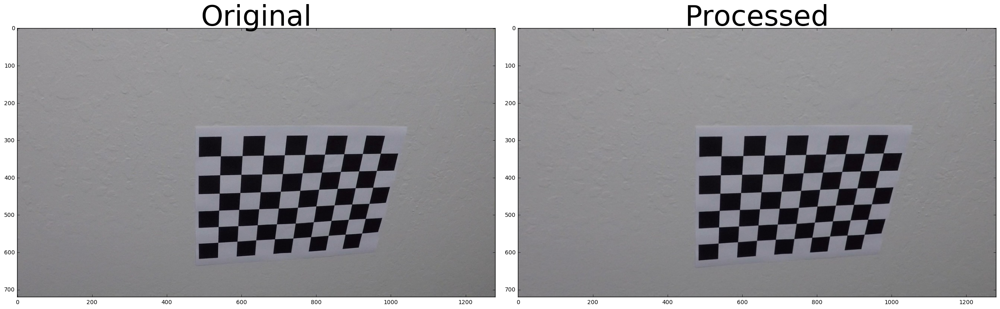
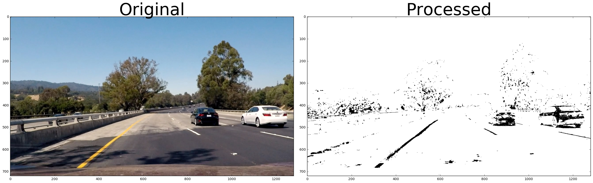
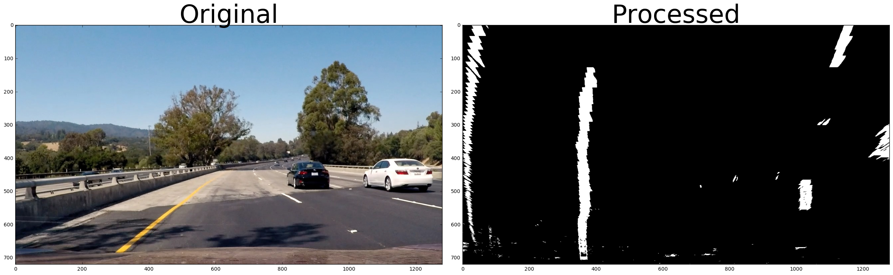
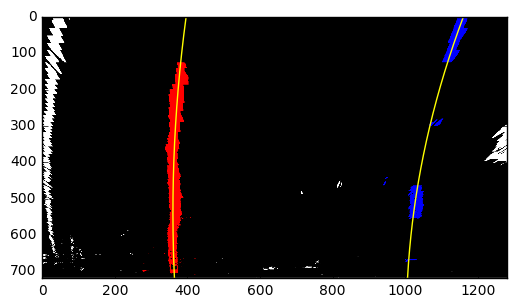
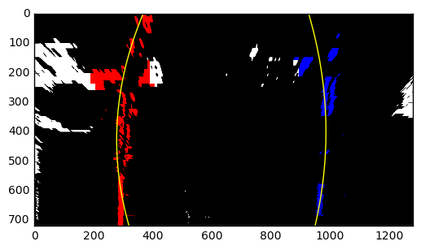

## Advance Lane Finding
---

**Advanced Lane Finding Project**

The goals / steps of this project are the following:

* Compute the camera calibration matrix and distortion coefficients given a set of chessboard images.
* Apply a distortion correction to raw images.
* Use color transforms, gradients, etc., to create a thresholded binary image.
* Apply a perspective transform to rectify binary image ("birds-eye view").
* Detect lane pixels and fit to find the lane boundary.
* Determine the curvature of the lane and vehicle position with respect to center.
* Warp the detected lane boundaries back onto the original image.
* Output visual display of the lane boundaries and numerical estimation of lane curvature and vehicle position.

### Here I will consider the [Rubric](https://review.udacity.com/#!/rubrics/571/view) Points individually and describe how I addressed each point in my implementation.  

---
### Writeup / README

The submission includs the following materials: 
- [x] A runnable iPython notebook contains details of my implementation, simply referenced as notebook in below;
- [x] A report, the Advanced_Lane_finding.md
- [x] A folder named "img4report" containing the images needed by the report;
- [x] A video, which is generated by the pipeline. 

### Camera Calibration

#### 1. Briefly state how you computed the camera matrix and distortion coefficients. Provide an example of a distortion corrected calibration image.

The code for this step is contained in the first section of notebook, titled "Rubric 1-1: Camera Callibaration & undistort image".

I start by preparing "object points", which will be the (x, y, z) coordinates of the chessboard corners in the world. Here I am assuming the chessboard is fixed on the (x, y) plane at z=0, such that the object points are the same for each calibration image.  The `objpoints` will be appended with a copy of it every time I successfully detect all chessboard corners in a test image.  `imgpoints` will be appended with the (x, y) pixel position of each of the corners in the image plane with each successful chessboard detection.  

I then used the output `objpoints` and `imgpoints` to compute the camera calibration and distortion coefficients using the `cv2.calibrateCamera()` function.  I applied this distortion correction to the test image using the `cv2.undistort()` function and obtained this result for calibration10.jpg: 



### Pipeline (single images)

#### 1. Provide an example of a distortion-corrected image.

The calculated calibration matrix and distortion coeffcients are applied to test4.jpg for undistortation, the result looks like this:

. 

The result can also be found in the notebook "Rubric 2-1: undistort a test image"

#### 2. Describe how (and identify where in your code) you used color transforms, gradients or other methods to create a thresholded binary image.  Provide an example of a binary image result.

I implenmented gradient based thresholdings, including abs_sobel, magnitude, and direction gradient, as well as hls color transformation using opencv, these methods were applied to a test image (with curvature in lane) in seperate and combined manner. I found that the best result could be achieved from combining abs_sobel_thresh in orientation "x" and hls color selection with a threshold (0, 160) for the given test images, so I used these two together. The detail is given in nothebook section "Rubric 2-2: gradient and color threshold"

Here's an example: 



#### 3. Describe how (and identify where in your code) you performed a perspective transform and provide an example of a transformed image.

The code for my perspective transform is given in the section "Rubric 2-3 perspective transform", a function named `warp_image()` does the perspective transformation; the function take in an `img` representing the orinial image. I hard coded the source and destination points in the following way: 

```
src = np.float32(
    [[(img_size[0] / 2) - 55, img_size[1] / 2 + 100],
    [((img_size[0] / 6) - 10), img_size[1]],
    [(img_size[0] * 5 / 6) + 60, img_size[1]],
    [(img_size[0] / 2 + 55), img_size[1] / 2 + 100]])
dst = np.float32(
    [[(img_size[0] / 4), 0],
    [(img_size[0] / 4), img_size[1]],
    [(img_size[0] * 3 / 4), img_size[1]],
    [(img_size[0] * 3 / 4), 0]])

```

Using these configuration, I verified that my perspective transforming was working as expected by verifying that the lines appear parallel in the warped image. Below is the generted warpped image. 



#### 4. Describe how (and identify where in your code) you identified lane-line pixels and fit their positions with a polynomial?

The detail of identificatio of lane line pixels is given in the notebook section "Rubric 2-4, indentifying the lane line pixels". I used the "sliding window" methods given by the lecture and find the pixel points which were used to fit the ploynomial line, numpy's built-in method `polyfit()` was used for the heavy load. The implementation was tested on  test images, result showed below: 

good fit: 


bad fit: 


#### 5. Describe how (and identify where in your code) you calculated the radius of curvature of the lane and the position of the vehicle with respect to center.

Once the ploynomial was fit, we know the coeffcients; the curvature can be calculated by the formula introducted in the lecture, the implementation is given in the notebook titled with "Rubric 2-5, finding lane curvature".

To calculate the curvature of real lane, we need to know the mapping between the pixel space and real world meter space, I used the configurations given in the lecture:

```
pixel_in_y = 720
pixel_in_x = 1280  
meters_in_x = 3.7
meters_in_y = 30

```

Then I applied them in the test image and calculated the curvature at the bottom of the image (the place where the camera is mounted at) and got the value of (left curvature, right curvature):
```
1014.41688751 m 1160.78978238 m
```

#### 6. Provide an example image of your result plotted back down onto the road such that the lane area is identified clearly.

I implementated a `pipe_line()` which first undistorted the test image using the calibrated camera matrix, then the undistorted image is applied to a combined threshing, then the threshholed binary image was given to warp function to do the perspective transformation, then the ploynomial was fit and the intendifid lane were drew back to the orinial image. The details are given in section "Rubric 2-6 pipline", one of the negerated image is like this:


---

### Pipeline (video)

#### 1. Provide a link to your final video output.  Your pipeline should perform reasonably well on the entire project video (wobbly lines are ok but no catastrophic failures that would cause the car to drive off the road!).

The vidoe is provided in the submission package, named "project_output.mp4"

---

### Discussion

#### 1. Briefly discuss any problems / issues you faced in your implementation of this project.  Where will your pipeline likely fail?  What could you do to make it more robust?

There were several difficulties/problems when finishing the project:
1. Finding a robust thresholding combination to detect lane line is hard. I had tried many configuraions, the kernel size, thresholding values, different combinations, there was no such a "generic" defination which can be applied to every case. Even if I managed to get a good detection on the test images, when it was applied to the video, there are cases that the detection fails. 
2. The source and destination coordinates in image warping is hard codes. it can not be easily migrated to another image size;
3. When the `pipe_line` was applied to the video, I found that the left yellow line is detected well, while the right lane was not, so instead of using the automatically detected riht lane line, I used the left lane line as base and offsetted certain value to get the ritht lane line, which certainly is not a portable way. 


