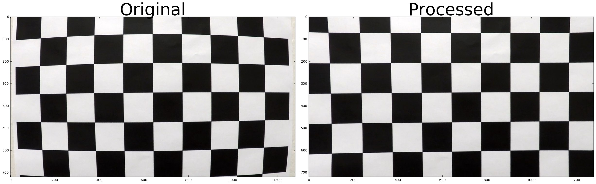
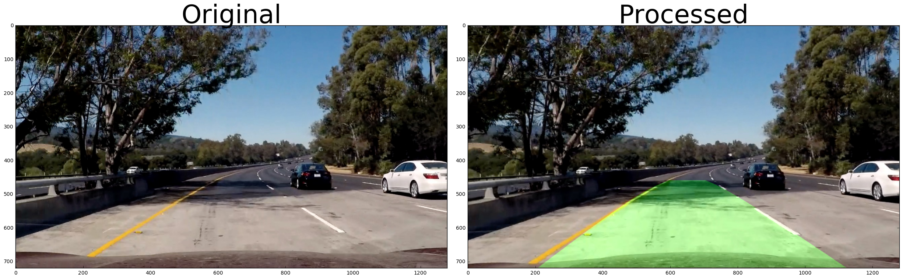

## Advance Lane Finding
---

**Advanced Lane Finding Project**

The goals / steps of this project are the following:

* Compute the camera calibration matrix and distortion coefficients given a set of chessboard images.
* Apply a distortion correction to raw images.
* Use color transforms, gradients, etc., to create a thresholded binary image.
* Apply a perspective transform to rectify binary image ("birds-eye view").
* Detect lane pixels and fit to find the lane boundary.
* Determine the curvature of the lane and vehicle position with respect to center.
* Warp the detected lane boundaries back onto the original image.
* Output visual display of the lane boundaries and numerical estimation of lane curvature and vehicle position.

### Here I will consider the [Rubric](https://review.udacity.com/#!/rubrics/571/view) Points individually and describe how I addressed each point in my implementation.  

---
### Writeup / README

The submission includs the following materials: 
- [x] A runnable iPython notebook contains details of my implementation, simply referenced as notebook in below;
- [x] A report, the "Advanced Lane Finding.md"
- [x] A folder named "img4report" containing the images needed by the report;
- [x] A video, which is generated by the pipeline. 

### Camera Calibration

#### 1. Briefly state how you computed the camera matrix and distortion coefficients. Provide an example of a distortion corrected calibration image.

The code for this step is contained in the first section of notebook, titled "Rubric 1-1: Camera Callibaration & undistort image".

I start by preparing "object points", which will be the (x, y, z) coordinates of the chessboard corners in the world. Here I am assuming the chessboard is fixed on the (x, y) plane at z=0, such that the object points are the same for each calibration image.  The `objpoints` will be appended with a copy of it every time I successfully detect all chessboard corners in a test image.  `imgpoints` will be appended with the (x, y) pixel position of each of the corners in the image plane with each successful chessboard detection.  

I then used the output `objpoints` and `imgpoints` to compute the camera calibration and distortion coefficients using the `cv2.calibrateCamera()` function.  I applied this distortion correction to the test image using the `cv2.undistort()` function and obtained this result for `calibration10.jpg`: 



As can be seen from this image, the curved line are straightened after undistortion.

### Pipeline (single images)

#### 1. Provide an example of a distortion-corrected image.

The calculated calibration matrix and distortion coefficients are applied to test4.jpg for undistortion, the result looks like this:

. 

The result can also be found in the notebook "Rubric 2-1: undistort a test image"

#### 2. Describe how (and identify where in your code) you used color transforms, gradients or other methods to create a thresholded binary image.  Provide an example of a binary image result.

I tried various thresholding methods and got the best result by combining the abs_sobel threshold in x orientation and the hls color transformation; for the hls, I used a threshold between (0, 160). The method was applied to the test images. One testing result is given below: 


The `test4.jpg` was chosen because it contains rich variances, brightness changing, road surface color changing, yellow line as well as wight line, solid line and dashed line. The result shows that the method works reasonably well as we can see clearly of the lanes.

The implementation detail is given in notebook section "Rubric 2-2: gradient and color threshold"

#### 3. Describe how (and identify where in your code) you performed a perspective transform and provide an example of a transformed image.

The code for my perspective transform is given in the section "Rubric 2-3 perspective transform". Here I defined two functions, one is `finetune_src_dst()` which is used to fine tuning the `source` and `destination` points used to image warping; the `warp_image()` does the perspective transformation. 

I fine tuned the `source` and `destination` points by plotting the points in the test images and eyeballed the reasonable position. One problem was that it's hard to find perfect points which could be applied to all the test images, so I purposely chose the points which were not so precision and thus make the values robust. And the final fine-tuned values are as following:

```
src = np.float32(
    [[(img_size[0] / 2)-55, img_size[1] / 2 + 100],   # top left
    [(img_size[0] / 4)-40, img_size[1] - 50],      # bottom left
    [(img_size[0] * 5 / 6)-10, img_size[1] - 50],   # bottom right
    [(img_size[0] / 2 + 70), img_size[1] / 2 + 100]])   # top right
    
dst = np.float32(
    [[(img_size[0] / 4), 0],
    [(img_size[0] / 4), img_size[1]],
    [(img_size[0] * 3 / 4), img_size[1]],
    [(img_size[0] * 3 / 4), 0]])
```

With this, I applied the `warp_image` method to test images. I can clearly see two nearly parallel lines in the center of the transformed images, the `test4.jpg` is show below: 


#### 4. Describe how (and identify where in your code) you identified lane-line pixels and fit their positions with a polynomial?

In the notebook section "Rubric 2-4, identifying the lane line pixels", I listed the details of how to identify the lane line pixels. Basically, I used the "sliding window" method shown in the lecture; Once the pixels were detected, Numpy's `polyfit()` method was used to fit the polynomial. 

The implementation was tested on  test images, 7 out the 8 test images shows positive result, `test5.jpg` shows a bad fit, results are list below:

good fit: 


bad fit: 


As can be seen from the image, the reason for this bad fit is the noisy pixels in the area of [200, 300] in y direction; one possible solution could be limit the sliding window to the area below the problematic area (y > 300). In my implementation, I leave this unsolved, because most of the images worked pretty well, and for situation like this, there will be sanity check to get rid of such negative effects. 

#### 5. Describe how (and identify where in your code) you calculated the radius of curvature of the lane and the position of the vehicle with respect to center.

Once the polynomial was fit, we know the coefficients; the curvature can be calculated by the formula introduced in the lecture. The implementation is given in the notebook section "Rubric 2-5, finding lane curvature" method `calculate_curvature`.

To calculate the curvature of real lane, we need to know the mapping between the pixel space and real world meter space, I used the configurations given in the lecture:

```
pixel_y = 720
pixel_x = 1280  
meters_x = 3.7
meters_y = 30
```

Then I applied them in the test image and calculated the curvature at the bottom of the image (the place where the camera is mounted at) and got the value of (left curvature, right curvature):
```
Left curvature: 2984.57 (m), Right Curvature: 1921.59 (m);
Offset 1.74 (m), Left from center;
```

#### 6. Provide an example image of your result plotted back down onto the road such that the lane area is identified clearly.

The `pipe_line` and `draw_filling` methods combined topics covered above and 
visualizes the result. They are given in notebook section "Rubric 2-6 pipeline"
An example given below:



---

### Pipeline (video)

#### 1. Provide a link to your final video output.  Your pipeline should perform reasonably well on the entire project video (wobbly lines are ok but no catastrophic failures that would cause the car to drive off the road!).

The video is provided in the submission package, named "project_output.mp4"

---

### Discussion

#### 1. Briefly discuss any problems / issues you faced in your implementation of this project.  Where will your pipeline likely fail?  What could you do to make it more robust?

There were several difficulties/problems when finishing the project:
1. Finding a robust thresholding combination to detect lane line is hard. I had tried many configurations, the kernel size, thresholding values, different combinations, there was no such a "generic" definition which can be applied to every case. Even if I managed to get a good detection on the test images, when it was applied to the video, there are cases that the detection fails. 
2. The source and destination coordinates in image warping is hard codes. it can not be easily migrated to another image size;

